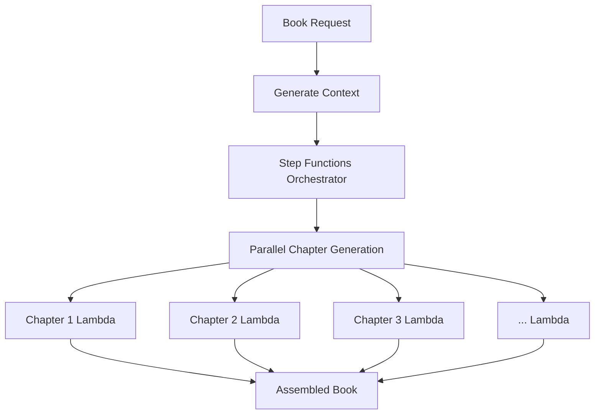

# Parallel Book Generation Architecture

**Generate complete books in under 5 minutes instead of 45-75 minutes** using stateless parallel chapter generation.

## The Problem

Current AI book generation tools process chapters sequentially:
- Chapter 1 completes → Chapter 2 starts → Chapter 3 starts...
- **Total time**: 45-75 minutes for a 10-chapter book
- **Single point of failure**: One timeout kills the entire book
- **Poor user experience**: Authors wait over an hour

## Our Solution

By making chapter generation stateless and injecting shared context, we achieve true parallel processing:
- All chapters generate simultaneously
- **Total time**: Under 5 minutes (typically 3.5 minutes)
- **Isolated failures**: One timeout doesn't affect other chapters
- **Better user experience**: Get your book in less time than brewing coffee

## Key Innovation

Traditional sequential approach treats each chapter as dependent on previous chapters. Our insight: **chapters don't need to wait for each other if you provide the right context upfront**.

```
Sequential (Old Way):           Parallel (Our Way):
[Ch1]→[Ch2]→[Ch3]→[Ch4]         [Ch1]
                                [Ch2] 
Time: 45+ minutes               [Ch3] ← All at once!
                                [Ch4]
                                
                                Time: <5 minutes
```

## Architecture Overview



## How It Works

1. **Context Generation**: Create a comprehensive context document containing all necessary information
2. **Parallel Orchestration**: AWS Step Functions Map state spawns concurrent executions
3. **Stateless Chapters**: Each chapter generates independently using injected context
4. **Smart Assembly**: Completed chapters are assembled in correct order

## Quick Start

```python
# Example usage pattern
context = generate_global_context(book_outline)
chapters = parallel_generate_chapters(context, chapter_count=10)
book = assemble_book(chapters)
```

See [ARCHITECTURE.md](ARCHITECTURE.md) for technical details.

## Use Cases

- **Publishing Platforms**: Generate books on-demand in minutes
- **Educational Content**: Create course materials rapidly
- **Content Agencies**: Scale book production without linear time costs
- **SaaS Applications**: Offer instant book generation to users

## Requirements

- AWS Lambda
- AWS Step Functions
- Python 3.9+
- Any LLM API (OpenAI, Anthropic, etc.)

## Limitations

- Requires upfront context generation
- Best suited for 5-20 non-fiction chapter books

## Contributing

This architecture pattern can be adapted for any parallel content generation need. PRs welcome!

## Related Projects
- [knobs-framework](https://github.com/Traviseric/knobs-framework) - Control system for maintaining quality and variation in parallel generation

## Citation

If you use this architecture in your work, please cite:
```
Parallel Book Generation Architecture (2024)
https://github.com/Traviseric/parallel-book-generation
```

## License

MIT

---

**This is not a wrapper around ChatGPT. This is a fundamental architectural innovation in AI content generation.**